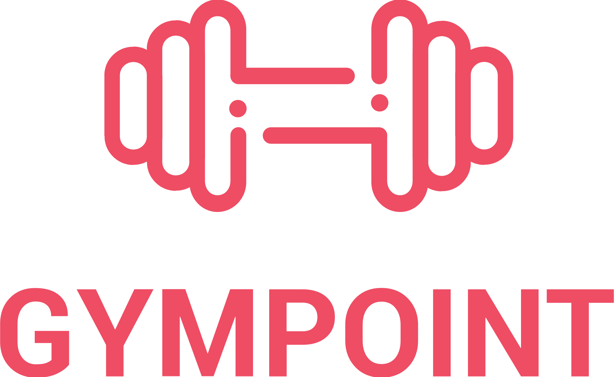
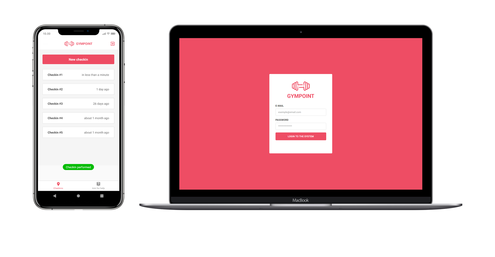

<h1 align="center">
    
</h1>

  <a href="#-instalação-e-execução">Instação e execução</a>&nbsp;&nbsp;&nbsp;|&nbsp;&nbsp;&nbsp;
  <a href="#rocket-tecnologias">Tecnologias</a>&nbsp;&nbsp;&nbsp;|&nbsp;&nbsp;&nbsp;
  <a href="#-projeto">Projeto</a>&nbsp;&nbsp;&nbsp;|&nbsp;&nbsp;&nbsp;
  <a href="#-layout">Layout</a>&nbsp;&nbsp;&nbsp;|&nbsp;&nbsp;&nbsp;
  <a href="#memo-licença">Licença</a>

 

  

## 🎓 Instalação e execução

1. Faça um clone desse repositório;
2. Entre na pasta rodando `cd GymPoint`;

### Backend

3. Entre na pasta rodando `cd backend`;
4. Rode `yarn` para instalar as dependências;
5. Crie e execute um banco de dados `Postgres` com o nome de `gympoint`;
6. Crie e execute um banco de dados `Redis`;
7. Renomeie o arquivo `.env.example` para `.env`;
8. Coloque as suas credenciais dentro do `.env`;
9. Rode `yarn sequelize db:migrate` para executar as migrations;
8. Rode `yarn sequelize db:seed:all` para executar as seeds;
11. Rode `yarn queue` para iniciar as filas;
10. Rode `yarn dev` para iniciar o servidor.

### Web

3. Entre na pasta rodando `cd frontend`;
4. Rode `yarn` para instalar as dependências;
6. Rode `yarn start` para iniciar o servidor.

### Mobile

3. Entre na pasta rodando `cd mobile`;
4. Rode `yarn` para instalar as dependências;
6. Rode `yarn react-native run-ios` ou `yarn react-native run-android` dependendo do SO.

## :rocket: Tecnologias

Esse projeto foi desenvolvido com as seguintes tecnologias:

- [Node.js](https://nodejs.org/en/)
- [React](https://reactjs.org)
- [React Native](https://facebook.github.io/react-native/)
- [Redux](https://redux.js.org/)

## 💻 Projeto

O GymPoint é um aplicativo gerenciador de academia, desenvolvido para avaliação final do bootcamp Rocketseat!

A parte mobile foi feita para `android` ao executar em um emulador `ios` pode conter alguns erros de layout.

## 🔖 Layout

Você pode baixar o layout do projeto no formato `.sketch` acessando a pasta `.github/layouts`.

Para abrir o arquivo no formato `.sketch` em qualquer sistema operacional utilize a ferramenta [Zeplin](https://zeplin.io).

## :memo: Licença

Esse projeto está sob a licença MIT. Veja o arquivo [LICENSE](LICENSE.md) para mais detalhes.

---

Feito com ♥ by Pedro Vignotto :wave: [Contato](https://www.linkedin.com/in/pedro-vignotto/)
